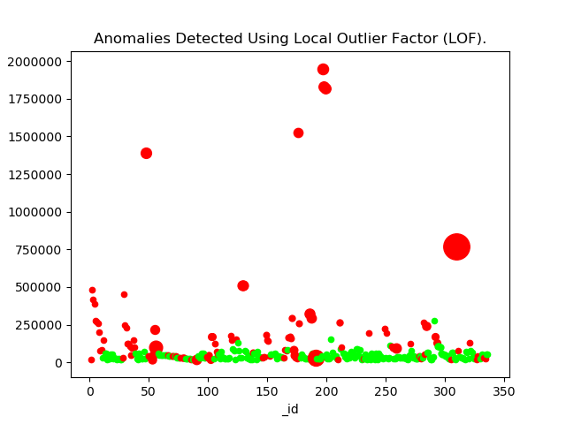

Data Sets Anomaly Detection Service for CKAN Based Governmental Data Portals
=========================

Requirements
-------
flask
requests
matplotlib
flask_cors
pandas


Setup
------
Make a new virtualenv:
```
$ virtualenv -p python venv
```
Activate the virtualenv:
```
$ source venv/bin/activate
```
Install dependencies from requirements.txt:
```
$ pip install -r requirements.txt
```
Run the service:
```
$ python rtpa-anomaly-detection.py
```
> Post Your Data at http://localhost:5000/detectAnomalies/lof

test service:
```
$ curl -X POST -H 'Content-Type:aplication/json' --data-binary @sampleData2.json http://127.0.0.1:5000/detectAnomalies/lof  -v -s
```

After initial setup
-------------------

Activate the virtualenv:
```
$ source venv/bin/activate
```
Run the service: p
```
$ python rtpa-anomaly-detection.py
```
> Post Your Data at http://localhost:5000/detectAnomalies/lof

Instead:
```
$ screen -S rtpa-anomaly source run.sh
```

Service Gates
----------

> POST: ****/detectAnomalies/lof

## Parameters:
```
x : ploting axis 1

y : ploting axis 2

analysisFeatures : Anomaly detection features/attributues, by default the service uses all the features.
```
```
e.g.

{

 "x":"_id",

 "y":"Paid Amt",

 "analysisFeatures":

                    ["Item Description","Paid Amt","Vendor Name",""],

 "result":

        "records": [{"Vendor Name": "HANLEY PEPPER LTD", "Item Description": "CIVIL ENGINEER PROFESSIONAL SERVICES", "_id": 1, "Paid Amt": "17077.09000000000014551915228366851806640625"},

                        {"Vendor Name": "BAM CIVIL LTD.", "Item Description": "CONSTRUCTION OF HOUSING", "_id": 2, "Paid Amt": "485000"}, ......}
```
#### output:
```
{ "messages": ["feature ( Latitude ) had NULL values and median is used instead to fill those places!",

"result": [[1.5192301625117677, 1, 17077.09], [0.7581782109282196, 2, 485000.0],

 [0.33291309394387153, 3, 417280.42], [0.33291309394387153, 4, 388000.0], ....... }

```

> POST ****/detectAnomalies/resource_quality


## Parameters

```
x : ploting axis 1

y : ploting axis 2

analysisFeatures : Anomaly detection features/attributues, by default the service uses all the features.

e.g.

{

 "x":"_id",

 "y":"Paid Amt",

 "analysisFeatures":

                    ["Item Description","Paid Amt","Vendor Name",""],

 "result":

        "records": [{"Vendor Name": "HANLEY PEPPER LTD", "Item Description": "CIVIL ENGINEER PROFESSIONAL SERVICES", "_id": 1, "Paid Amt": "17077.09000000000014551915228366851806640625"},

                        {"Vendor Name": "BAM CIVIL LTD.", "Item Description": "CONSTRUCTION OF HOUSING", "_id": 2, "Paid Amt": "485000"}, ......}

```
## Output
```
{ "messages": ["feature ( Latitude ) had NULL values and median is used instead to fill those places!",


"result":

 {"EstimatedOutturn2013":

  {
  "totalReadings":29,

  "uniques": [0, 1, 2, 3, 4, 5, 6, 7, 8, 9, 10, 11, 12, 13, 14, 15, 16, 17, 18, 19, 20, 21, 22, 23, 24, 25, 26, 27, 28],

  "nulls": []
  "nullCount": 11
  "uniqueCount":0

   },

   .....}


```
> GET: ****/detectAnomalies/lof/get_image?

## Parameters:
```
x=_id

y=Paid%20Amt

url=http%3A%2F%2Fdublin-tet.routetopa.eu%3A8080%2Fapi%2Faction%2Fdatastore_search%3Fresource_id%3D8e761a2a-f16f-4c9e-8d4e-2ebc42f56b4c%26limit%3D99999%0A
```

## output:



Last Update
----------
May 2017

*Readme still requires updates to much current features
